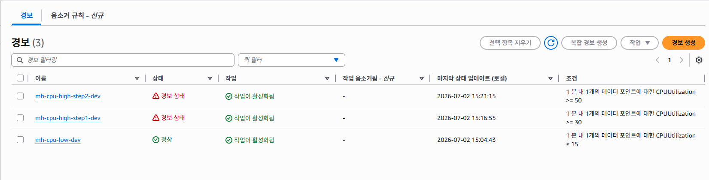
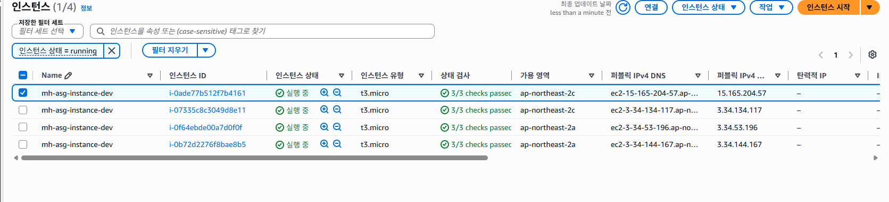
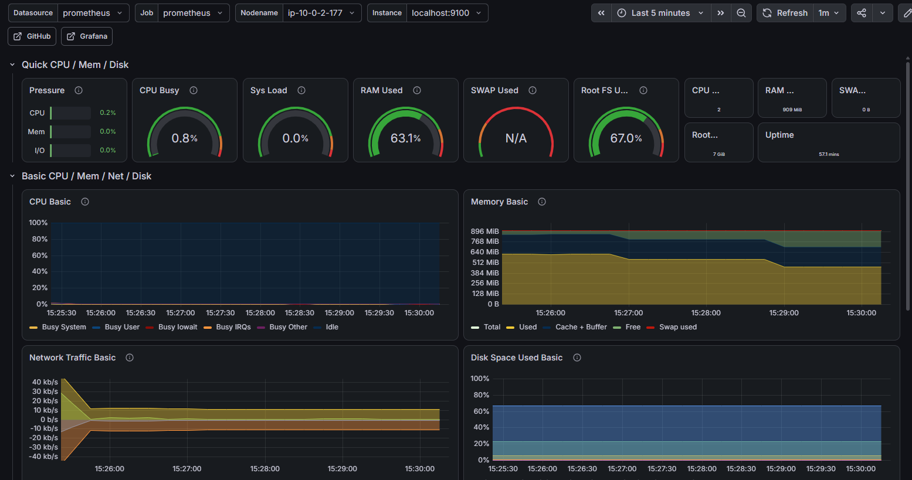

# 🚀 AWS 기반 지능형 Auto Scaling Architecture & Real-time Monitoring

> **AWS EC2 Auto Scaling Group(ASG)**과 **CloudWatch**를 연계하여 트래픽 부하에 따라 유연하게 방어선을 구축하고, 비용 최적화를 위해 순차적으로 자원을 회수하는 **지능형 탄력적 아키텍처** 구축 및 검증 프로젝트입니다. 
> 오픈소스 모니터링 도구인 **Prometheus와 Grafana**를 통해 실시간 메트릭을 추적하고, 아키텍처 한계점 분석을 통한 개선 과제까지 도출해 냈습니다.

---

## 🏗️ Architecture Overview

- **Infrastructure as Code (IaC):** Terraform을 통한 인프라 자원 프로비저닝 자동화
- **Compute & Scaling:** AWS ALB + EC2 Auto Scaling Group (Min: 2, Max: 4)
- **Monitoring & Alerting:** CloudWatch Alarm (Step-scaling) + Prometheus & Grafana (Node Exporter)

---

## 🎯 Auto Scaling Scenario & Core Logic

CloudWatch Metric Alarm의 `GreaterThanOrEqualToThreshold` 및 `LessThanThreshold` 조건을 활용하여, 부하 강도에 따른 **단계별 스케일 아웃(Scale-out)** 및 **안정적인 순차 스케일 인(Scale-in)**을 구현했습니다.

### 📈 Scale-out (확장)
1. **1단계 방어선 (CPU ≥ 30%):** 전체 평균 CPU 사용률이 30% 돌파 시, CloudWatch Alarm (`step1`)이 트리거되어 인스턴스 1대 추가 증설 (**2대 ➡️ 3대**)
2. **2단계 방어선 (CPU ≥ 50%):** 부하가 지속되어 50%마저 돌파 시, CloudWatch Alarm (`step2`)이 트리거되어 남은 1대 추가 증설 (**3대 ➡️ 4대, Max Limit**)

### 📉 Scale-in (축소 & 비용 최적화)
- **안전 순차 철수 (CPU < 15%):** 서비스가 안정화되어 평균 CPU가 15% 미만으로 떨어지면, `cpu_low` 알람이 가동됩니다. 자원의 급격한 유실로 인한 서비스 장애를 방지하기 위해 **3분의 쿨다운(Cooldown) 주기**를 두고 인스턴스를 순차적으로 1대씩 안전하게 차감합니다 (**4대 ➡️ 3대 ➡️ 2대**).

---

## 🧪 Validation & Test Scenario (검증 과정)

`stress` 도구를 활용하여 인스턴스에 강제로 CPU 부하를 주입하고, 인프라의 탄력적 변화를 모니터링하는 전 과정을 검증했습니다.

| Phase | 인프라 상태 | 실행 액션 & 시스템 변화 |
| :--- | :--- | :--- |
| **Phase 1** | 평상시 (안정기) | 부하 없음. 평시 기준인 **2대**의 인스턴스 안정적 유지 |
| **Phase 2** | 1단계 임계치 돌파 | 1번 서버 부하 투하 ➡️ 그룹 평균 CPU 30% 돌파 ➡️ **3번째 서버 자동 소환** |
| **Phase 3** | 2단계 임계치 돌파 | 2/3번 서버 추가 부하 투하 ➡️ 그룹 평균 CPU 50% 돌파 ➡️ **4번째 서버(최대치) 자동 소환** |
| **Phase 4** | 트래픽 해제 및 철수 | 부하 종료 (`pkill`) ➡️ CPU 15% 미만 급락 ➡️ **3분 간격으로 4대 ➡️ 3대 ➡️ 2대 순차 축소** |

---

## 📸 Verification (증빙 자료)

*(확보하신 캡처 이미지들을 `./images/` 등의 폴더에 넣고 아래 경로를 수정하여 연결해 주세요!)*

### 1. CloudWatch Alarms & EC2 ASG Status
> 트래픽 폭증 시 30%, 50% 임계치 경보가 동시에 트리거(In Alarm)되지만, Terraform 코드로 묶어둔 `max_size = 4` 제한이 정확히 작동하여 무분별한 비용 증식 없이 최대 방어선인 4대까지만 안정적으로 스케일 아웃됨을 확인했습니다.
<!--  -->
<!--  -->

### 2. Grafana Real-time Dashboard
> `stress` 종료 시점을 기점으로 CPU 사용률 안정기로 복귀하는 대시보드 시계열 화면입니다.
<!--  -->

---

## 🚨 Troubleshooting & Architecture Improvement (한계점 및 개선 과제)

본 실습을 진행하며 프로덕션 환경 관점에서 보완해야 할 **두 가지 핵심 아키텍처적 한계점**을 발견하고 개선 방향을 도출했습니다.

### 1. Scale-in 발생 시 모니터링 시스템(Grafana/Prometheus) 다운타임 발생
- **현상:** 오토 스케일링 그룹이 자원을 축소(4대 ➡️ 2대)하는 과정에서, 하필 모니터링 패키지가 설치되어 구동 중이던 특정 웹 서버 인스턴스를 삭제 대상으로 판단하여 Target으로 지정 및 종료함. 이로 인해 인프라가 축소되는 순간 그라파나 대시보드 연결이 끊어지는 가용성 이슈 발생.
- **개선안:** **관심사의 분리(Separation of Concerns)** 원칙에 따라, 수시로 생성·소멸하는 웹 애플리케이션 레이어와 모니터링 레이어를 완전히 격리해야 함. ASG 외부의 독립된 모니터링 전용 EC2를 구축하거나, AWS Managed Prometheus / Managed Grafana 서비스를 도입하여 가용성을 100% 확보할 예정.

### 2. 메트릭 수집 범위(Scope) 불일치로 인한 대시보드 왜곡
- **현상:** CloudWatch는 오토 스케일링 그룹 전체의 '합산 평균 CPU'를 기준으로 경보를 계산하여 30%, 50%를 유연하게 판단한 반면, 오픈소스 Grafana 대시보드(Node Exporter)는 기본 쿼리가 개별 인스턴스 단위를 타깃팅하고 있어 4대 중 단 1대만 부하가 걸려도 대시보드상에서는 CPU가 100%로 붉게 타오르는 스코프 불일치 현상 발생.
- **개선안:** Grafana 패널의 PromQL 수식을 특정 인스턴스 고정이 아닌, 현재 클러스터에 존재하는 전체 인스턴스들의 메트릭을 동적으로 긁어와 평균을 내는 그룹화 쿼리(`avg(100 * (1 - rate(node_cpu_seconds_total{mode="idle"}[5m])))`)로 고도화하여 인프라 전체의 정확한 토폴로지 상태를 한눈에 모니터링할 수 있도록 리팩토링할 예정.
